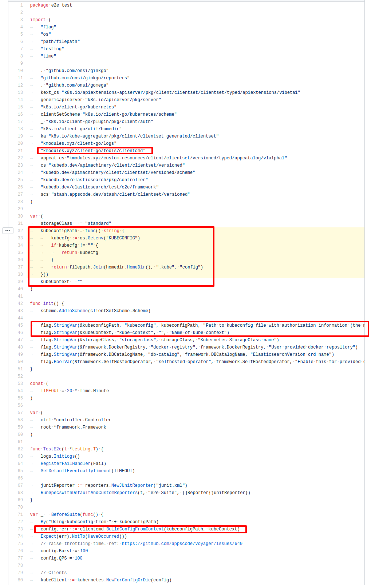

# e2e-test-setup

For our e2e tests on GitHub actions, we are using [KIND](https://kind.sigs.k8s.io) (Kubernetes IN Docker). This creates a single master and 2 worker node cluster using only Docker.

## Install KIND v0.6.1

You only need to do this once.

```console
curl -LO https://github.com/kubernetes-sigs/kind/releases/download/v0.6.1/kind-$(uname)-amd64 \
  && sudo install kind-$(uname)-amd64 /usr/local/bin/kind \
  && rm -rf kind-$(uname)-amd64

# this directory is used to provision hostpath PVCs
mkdir -p /mnt
```

## Create a Cluster matching our e2e setup

```console
curl -fsSL https://github.com/appscodelabs/e2e-test-setup/raw/kind-v0.6.1/run.sh | bash
```

## Delete cluster

```console
kind delete cluster
```

## How to pass cloud credentials to e2e tests in GitHub actions

[](https://www.youtube-nocookie.com/embed/8QtXBaGY9q4)

## How to add e2e tests to a new project

[](https://www.youtube-nocookie.com/embed/WSmj8uNhaCU)

## Using both KIND and Minikube cluster in e2e tests

Code Sample:
https://github.com/kubedb/elasticsearch/blob/cb48734f37c7d142400b216034434947fd5edfae/test/e2e/e2e_suite_test.go#L32-L46

[](https://github.com/kubedb/elasticsearch/blob/cb48734f37c7d142400b216034434947fd5edfae/test/e2e/e2e_suite_test.go#L32-L46)
